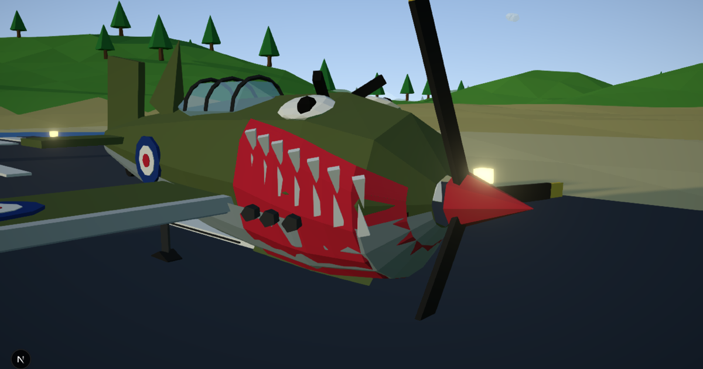

<p align="center"></p>

<h1 align="center">SHARKPLANE</h1>
<p align="center"><b>You are a big plane with a bad attitude. Don't shoot them — eat them.</b></p>
<p align="center">
  <a href="https://oddurs.github.io/sharkplane/">▶ Play in your browser</a> ·
  <a href="https://github.com/oddurs/sharkplane/actions/workflows/ci.yml"></a>
  <a href="LICENSE"></a>
</p>

A low-poly arcade flight game. Throttle up, roll down the strip, pull up, and chase planes down with a shark-mouthed WW2 fighter. Gobble them in one bite (two for bombers, five weak points for the zeppelin), chain combos into a feeding frenzy, keep the FOOD meter up, and chase two daily objectives for a medal. Three-minute sorties; everyone gets the same skies each day.

Everything is procedural — terrain, planes, sky, music and every sound effect are generated in code. No downloads, no accounts, no servers.

## Controls

| Action | Keyboard | Gamepad |
|---|---|---|
| Pitch (pull back to climb) | `S` / `W` or `↓` / `↑` | left stick |
| Roll / ground steer | `A` / `D` or `←` / `→` | left stick |
| Yaw | `Q` / `E` | bumpers |
| Throttle up / down | `Shift` / `Ctrl` | `RT` |
| Brake (on ground) | `Ctrl` | `LT` |
| Boost (hold) / bite lunge (tap) | `Space` | `A` |
| Free look | right-drag | right stick |
| Pause | `Esc` | `Start` |

Touch controls appear on phones/tablets (or turn them on in Options). Pitch can be un-inverted in Options.

## Features

- Direct arcade flight model with forgiving ground handling; bounce, never die
- Fighters, two-bite bombers, weaving escort pairs, a zeppelin boss every third wave; enemies flee, tire, panic, and crash
- 3-D target markers, edge arrows, lock-on, radar with altitude ticks
- Feeding frenzy, hunger meter, daily objectives, medals, five unlockable liveries, persistent progress
- Time-of-day palettes with a live day cycle, rain, wind, birds to snack on, a ferry, a lighthouse, ground crew that duck
- Layered procedural audio: radial engine model, positional enemy engines with Doppler, beat-synced swing soundtrack with intensity layers, radio chatter with subtitles (EN / IS)
- Accessibility: captions for sounds, reduced motion, high-contrast HUD, colour-blind marker tags, gamepad rumble, touch controls
- Installable PWA, works offline after first load

## Run it yourself

```sh
npm ci
npm run dev     # http://localhost:5995
npm test        # unit tests
npm run lint
npm run build   # static export → out/
npm run e2e     # headless gameplay smoke test against out/ (needs Chrome; set CHROME=/path/to/chrome)
```

Add `?debug` to the URL to expose `window.__game` (engine, player, enemies) for poking around.

## How it's built

- **Next.js 16 + React 19** for the shell, HUD and menus (a tiny external store feeds the HUD at 60 Hz)
- **three.js** for everything on the canvas — lofted low-poly hulls (`lib/loft.ts`), sky-dome shader, bloom/FXAA/vignette post
- **WebAudio** synthesis for all sound (`lib/audio.ts`): buses + limiter, engine voice, positional enemy voices, a step sequencer
- A phase machine in `lib/engine.ts`: `title → intro → countdown → playing ⇄ paused → roundOver`
- Daily seed (`lib/rng.ts`) drives sky, weather and objectives

Deployed to GitHub Pages as a static export by `.github/workflows/deploy.yml` on every push to `main`.

## Contributing

See [CONTRIBUTING.md](CONTRIBUTING.md). Bug reports and tuning ideas welcome — especially "this felt wrong" notes with the number you changed.

## License

[MIT](LICENSE). The display font is [Bungee](https://fonts.google.com/specimen/Bungee) (SIL OFL), bundled at build time.
